En aquest article explico el procés per obtenir una representació precisa de les regions actives del Sol a partir de les fotografies que capturo amb un modest refractor i una càmera dedicada.

L´objectiu és alinear les nostres imatges amb la posició real del Sol. Per aconseguir-ho, utilitzo un sistema de referència que permet localitzar de manera precisa i unívoca les regions actives (AR). Només així podem comparar les nostres fotografies solars amb les dades heliogràfics de referència proporcionades diàriament pels organismes oficials.

A continuació, detallo els passos que he seguit per aconseguir el nostre objectiu:

Referències oficials Presento els organismes oficials que utilitzo com a referència per obtenir dades solars amb precisió. Aquestes institucions proporcionen informació actualitzada diàriament a través d'Internet

Sistema de coordenades heliogràfiques Aquí faig el repàs dels tres paràmetres fonamentals que sustenten el sistema de coordenades heliogràfiques. Aquests paràmetres ens permeten mesurar i determinar amb precisió els valors reals de les regions actives (AR) a la superfície del Sol.

Dibuix de la reixeta de coordenades Exposo els requeriments inicials necessaris per dissenyar la reixeta de coordenades, que servirà com a base per fabricar una plantilla aplicable a PixInsight.

Aplicació de les plantilles Descric el procés per integrar les plantilles amb les nostres fotografies solars. Encara que detallo el seu ús amb PixInsight, aquestes plantilles també són compatibles amb altres programes de processament gràfic, com ara Photoshop, GIMP o altres opcions similars.

## 1. Referències oficials per a les AR's

La primera referència que utilitzo és un gràfic que ens mostra les AR's a Halfa i el podem trobar a:

<https://www.sidc.be/spaceweatherservices/applications/solarmap/>

El domini sidc.be pertany al Solar Influences Data Analysis Center (SIDC), que és part de l'Observatori Reial de Bèlgica (Royal Observatory of Belgium).

Aquest centre s´especialitza en l´anàlisi de dades solars, incloent l´observació de taques solars i fenòmens relacionats amb el clima espacial.

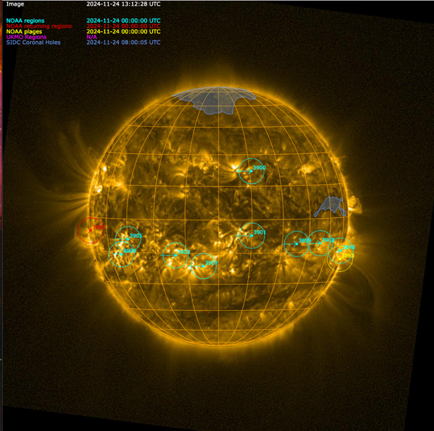

A més, és un Centre Regional d'Advertiment (RWC) per al monitoratge i el pronòstic del clima espacial dins de la xarxa internacional del Servei Internacional de Clima Espacial (ISES).

A més de les regions actives podem seleccionar els grups de taques solars dels equips o institucions que són referència, com SIDC/USET de Bèlgica i INAF/OACT d'Itàlia, les platges (regions brillants que apareixen a la fotosfera), les AR's esperades, etc

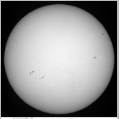

Per veure els sunspots en llum blanca, solc consultar SOHO :

<https://soho.nascom.nasa.gov/sunspots/>

De vegades, pot passar que alguna referència no coincideixi entre tots dos sistemes. En aquests casos, quan necessito verificar el calibratge de les meves fotografies solars, consulto:

<https://www.swpc.noaa.gov/products/solar-region-summary>

que correspon a la NOAA, National Oceanic And Atmosferic Administration.

Aquí obtenim un resum diari actualitzat a les 00:30 UTC. És important tenir en compte que aquestes dades corresponen al dia anterior, cosa que pot generar un desfasament significatiu respecte a les nostres captures.

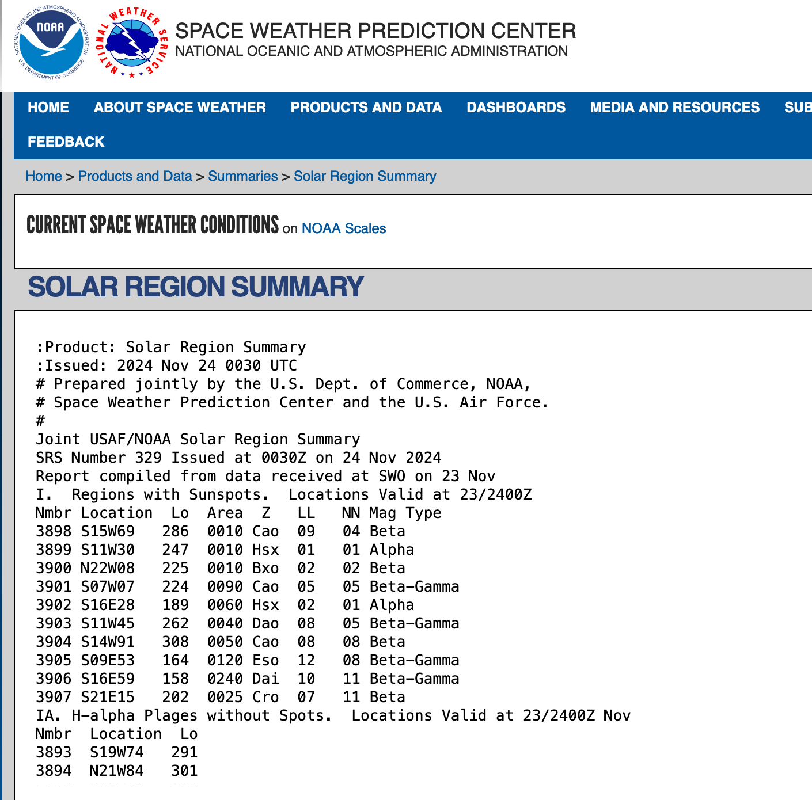

En realitat, a més de la informació obtinguda en llibres de consulta, la veritable inspiració per representar les coordenades heliogràfiques va provenir de la magnífica representació del Royal Observatory of Belgium que hem vist anteriorment.

## 2. Sistema de Coordenadas Heliogràfiques (1)

Com ja hem comentat, necessitem un sistema de referència per poder saber a quines posicions ens referim.

Inicialment, podem considerar un sistema de coordenades similar al de la Terra, amb dos pols oposats, on el pol Nord (N) és a dalt i equidistant del centre de l'esfera solar. En referir-nos a 'N a dalt', entenem que el pol Nord solar es troba al nord de l'equador celeste.

L'est (E) el considerem com a la Terra però com si estiguéssim posicionats al Sol; des del nostre punt de vista és a l'esquerra.

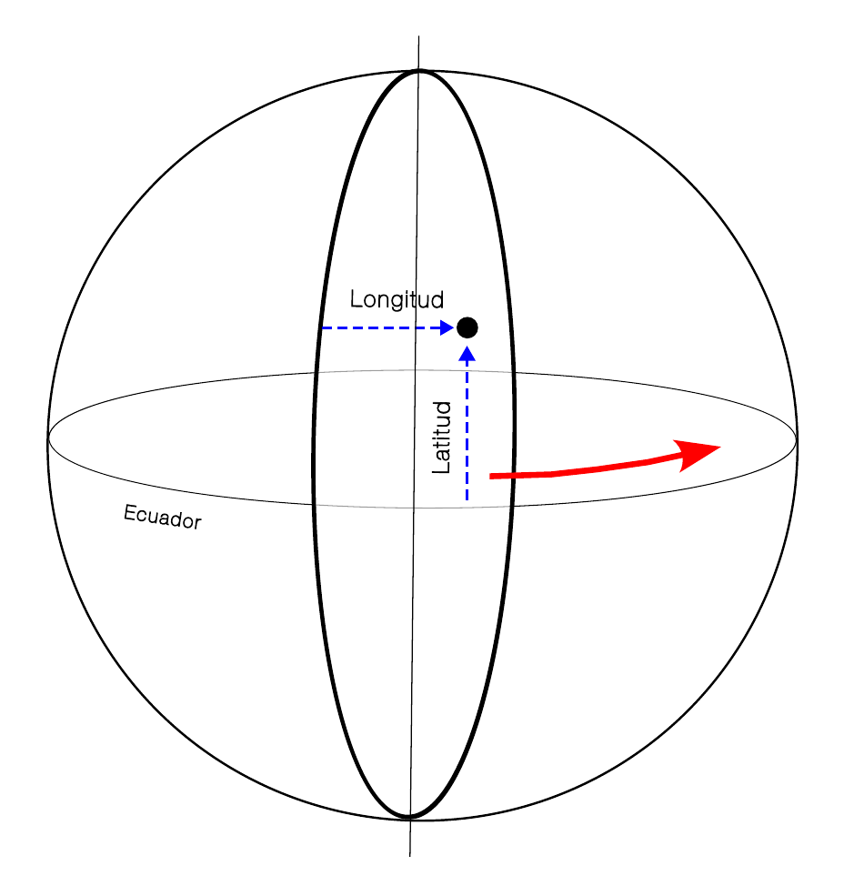

Definim la latitud heliogràfica com la distància angular d'un punt qualsevol a l'equador, com a mesura N o S i de 0 a +90°/-90°.

Qualsevol cercle perpendicular a l'equador serà un meridià.

Com que el Sol és un cos gasós, no tenim referències com tenim a la Terra i el que fem és mesurar la longitud des del meridià origen (2) (anàleg al nostre meridià de Greenwich) sempre en sentit de la rotació del Sol cap a l'Oest (W) de 0° a 360°.

El valor per al meridià origen (2) ho obtenim igual que els altres dos que necessitarem (P i B0) mitjançant consulta de les efemèrides.

L'eix terrestre té una inclinació respecte a l'eclíptica de +23.5° i apunta cap a l'estrella Polar; al Sol, l'eix es troba inclinat 7.25° i apunta en una direcció completament diferent.

Per això, al llarg de l'any, a mesura que la Terra es mou al llarg de la seva òrbita, canvia la nostra perspectiva i veiem els pols i l'equador del Sol variant de posició al llarg de l'any.

L'angle P es defineix com la inclinació de l'eix solar respecte a la direcció del Nord terrestre. Pot tenir un valor màxim de 26.3°, positiu cap a l'E i negatiu cap al W.

Es defineix l'angle B0 com la inclinació del pla de l'equador solar, passant de 0° a +/-7.25°. Quan B0 és positiu, el pol Nord s'inclina cap a nosaltres; quan és negatiu el pol Sud s'inclina cap a nosaltres i el pol Nord queda a l'hemisferi ocult.

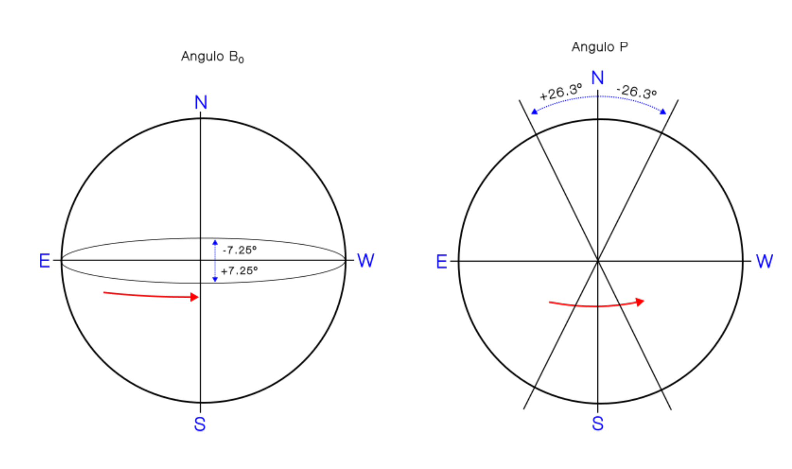

Així com P i B0 ens donen informació de com es posiciona la xarxa de coordenades sobre el disc solar, l'angle que anomenem L0 ens dóna informació sobre la posició del meridià origen (2).

Vist des del sistema de referència del Sol i degut a com es va definir el meridià origen (2), L0 varia de 0° a 360° en sentit horari solar de W a I'E; és a dir, L0 s'incrementa a mesura que es produeix la rotació del Sol .

Quan L0=90° el meridià origen coincideix amb els llimbs Est i coincideix amb l'Oest quan L0=270°.

Quan L0=180°, el meridià origen coincideix amb el centre del disc però a l'hemisferi ocult.

Quan consultem L0 des d'un programari astronòmic com Cartes du Ciel, veiem que el valor numèric disminueix amb el pas dels dies perquè es calcula tenint en compte la posició relativa Terra-Sol.

P i B0 depenen de la posició de la Terra a l'espai i, per tant, repeteixen aproximadament els mateixos valors en les mateixes dates.

Per determinar la posició d'una AR, mesurem la longitud respecte al meridià central i després sumem o restem aquest valor al valor de L0 per al meridià origen en aquell moment; així obtenim la longitud heliogràfica.

Els valors de P, B0 i L0 es poden obtenir consultant les efemèrides mitjançant un programari astronòmic. En el meu cas, faig servir Cartes du Ciel.

Definicions:

(2) El 1863, Richard Carrington va definir el meridià d'origen de la manera següent: l'equador solar està inclinat respecte al pla de l'eclíptica, i els punts d'intersecció entre tots dos es coneixen com a nodes. El node en què l'equador ascendeix per sobre de l'eclíptica, segons el sentit de la rotació solar, s'anomena node ascendent, mentre que el seu oposat és el node descendent. El meridià que passava pel node ascendent l'1 de gener de 1854 a les 12 h UT es considera el meridià origen.

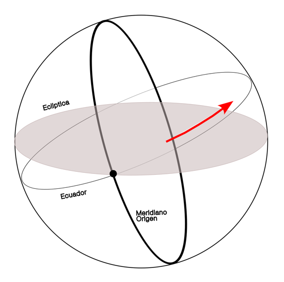

Tot i que aquesta definició pot semblar una mica complexa, no té gran rellevància, ja que les efemèrides proporcionen aquesta informació de manera constant.

## 3. Dibuix de la reixeta de coordenades

### 3.1 Disseny de la reixeta de coordenades heliogràfiques

Hem vist que el paràmetre B0 varia durant l'any des de +7,25° a -7,25°. La variació es produeix contínuament i per poder representar amb bona precisió triem reixetes amb passos de 1° (Javier Ruiz 2018, 199); és a dir, necessitarem les reixetes següents amb valors de B0:

`+7°, +6°, +5°, +4°, +3°, +2°, +1°, +0°, -1°, -2°, -3°, -4°, -5°, -6°, -7°`

`Amb cadascuna de les reixetes abracem els següents valors de B0:`

`reixeta valors`

`B0= +6 +6.5 > B0 ≥ +5.5`

B0= +5 +5.5 > B0 ≥ +4.5

B0= +4 +4.5 > B0 ≥ +3.5

B0= +3 +3.5 > B0 ≥ +2.5

B0= +2 +2.5 > B0 ≥ +1.5

`B0= +1 +1.5 > B0 ≥ +0.5`

`B0= +0 +0.5 > B0 ≥ -0.5`

`de forma anàloga per a valors negatius:`

`reixeta valors`

B0= -1 -0.5 > B0 ≥ -1.5

B0= -2 -1.5 > B0 ≥ -2.5

B0= -3 -2.5 > B0 ≥ -3.5

B0= -4 -3.5 > B0 ≥ -4.5

B0= -5 -4.5 > B0 ≥ -5.5

B0= -6 -5.5 > B0 ≥ -6.5

B0= -7 -6.5 > B0 ≥ -7.5

Veiem que cada reixeta abasta una àrea de 1°

Per no saturar amb massa línies triem separació de 10° per als meridians i 15° per als paral·lels.

### 3.2 Dibuix de la reixeta bàsica

En primer lloc, considerem realitzar el disseny utilitzant un programa de dibuix 2D, com Inkscape, un programari de codi obert i distribució gratuïta.

La reixeta corresponent a B0 = +0 serà la primera que dissenyarem perquè el pla de l'equador solar no té cap desplaçament; això correspon al voltant del 6 de juny i del 7 de desembre. A partir d'aquesta plantilla, desplaçarem les línies dels paral·lels 1° cap al S cada vegada per formar les 7 primeres i el mateix cap al N per a les set últimes.

`Per tenir en compte les variacions de l'angle P (variacions de l'eix polar), en comptes de moure la nostra reixeta, mouríem la foto del nostre Sol els graus necessaris indicats pel valor de P, de manera que l'eix polar N-S quedi sempre en posició vertical.`

A més que el que s'ha exposat sembla lògic, també coincideix amb que les reixetes de les nostres webs de referència sempre dibuixen el N a dalt!!

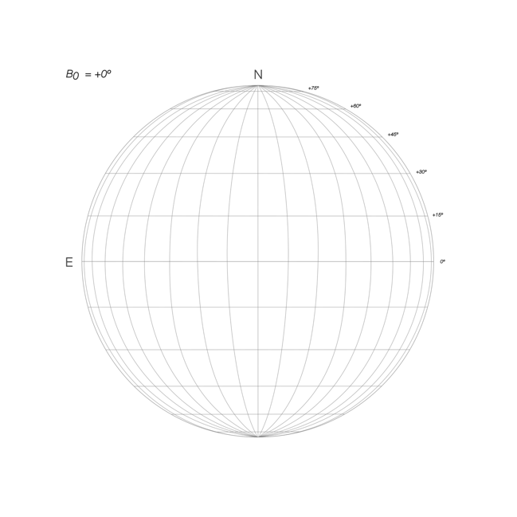

`Tenint en compte el que s'ha mencionat anteriorment, dibuixem la nostra primera reixeta per a B0=0, que presenta l'aspecte mostrat en el gràfic adjunt:`

Com hem comentat anteriorment, aquesta reixeta ens servirà per a valors:

+0.5 > B0 ≥ -0.5

Escollim utilitzar una reixeta amb passos de 10° en longitud i de 15° en latitud, i per tant, els paral·lels es distribueixen cada 15° i els meridians cada 10°.

La posició en Z de cada paral·lel ve donada per: r⋅sen(15), r⋅sen(30), r⋅sen(45), r⋅sen(65), r⋅sen(75), i els radis respectius tenen els valors: r⋅cos(15), r⋅cos(30), r⋅cos(45), r⋅cos(65), r⋅cos(75).

Amb aquests dades podem dibuixar directament la nostra reixeta base.

### 3.3 Dibuixar les diferents reixetes heliogràfiques en 2D

Com hem comentat anteriorment, crearem una reixeta per a cada variació de 1° en la inclinació del pla ecuatorial.

Com observem el disc solar ortogonalment, veurem el desplaçament de la part central dels nostres paral·lels segons la fórmula: d = r⋅sin(α), on r és el radi de la nostra circumferència i α és l'angle de cada paral·lel, el valor del qual es veurà augmentat o disminuït en funció de la plantilla que hem dibuixat.

Ja que les plantilles s'aplicaran a una imatge fotogràfica que es mesura en píxels (px), passarem a aquesta unitat a partir d'ara.

Per entendre-ho millor, poso l'exemple de les desviacions en Z per a una plantilla de 1000 px de radi i desviacions polars de +1° a +7°:

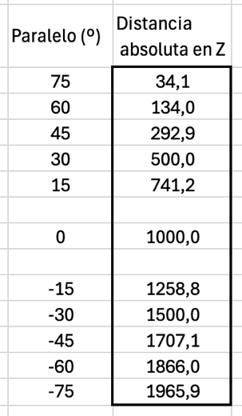

Si posicionem l'equador, paral·lel 0º, en z=1000, la taula adjunta mostra les posicions dels diferents paral·lels per a la plantilla corresponent a B0=0.

Les desviacions relatives (+d) en píxels per a cada paral·lel en funció dels diferents valors de B0:

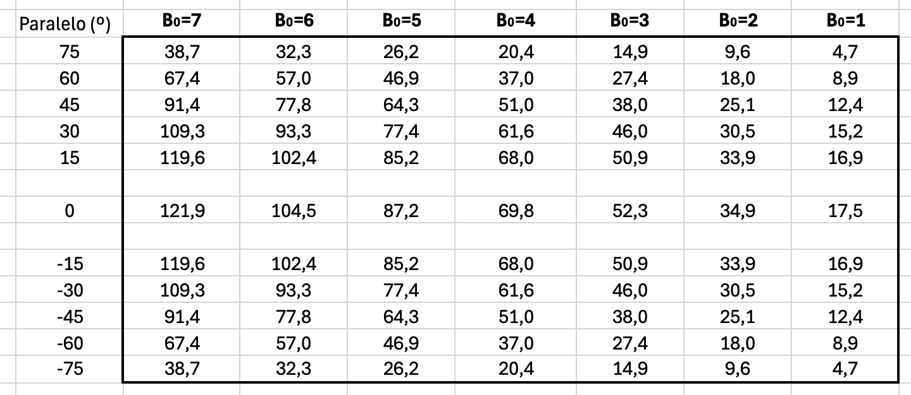

I les posicions absolutes de les plantilles en funció dels valors de B0 :

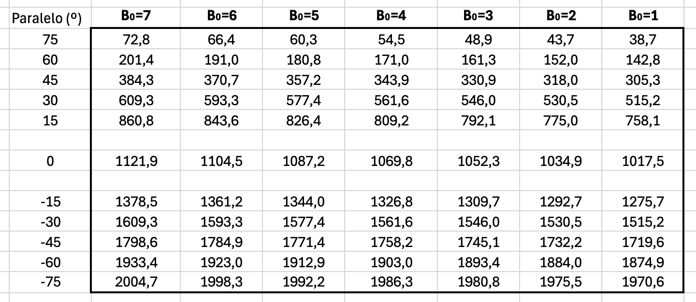

A aquests valors només quedaria afegir l'offset necessari per deixar el dibuix centrat en Z segons les nostres necessitats.

Els valors obtinguts corresponen al centre del paral·lel; la curvatura des dels extrems E i W (que queden fixos) s'ha de realitzar de forma manual segons el criteri de cadascú.

Per als valors de B0 = -1 a B0 = -7, els càlculs són iguals però els increments es realitzen en sentit contrari.

El gràfic adjunt és la plantilla acabada amb aquest sistema per a B0 = +7.

El resultat és acceptable, però podem incórrer en errors, especialment a les zones polars. No obstant això no és crític, ja que en aquestes àrees no solem trobar AR's. El major error es produeix allí, perquè en realitat no hem 'rotat' el dibuix.

Per aquest motiu, i perquè modificar tots els paral·lels de les 15 plantilles, tot i que és força sistemàtic, és tediós; he pensat crear les plantilles mitjançant un CAD 3D.

### 3.4 Dibuixar les diferents reixetes heliogràfiques en 3D

Vull dissenyar una reixeta amb les mateixes característiques que en l'apartat de 2D, però per facilitar la feina, he pensat crear una reixeta patró que podré rotar en increments de 1°. D'aquesta manera, podré obtenir les 15 posicions necessàries sense haver de retocar cada paral·lel de manera independent

Per dibuixar he seleccionat FreeCAD, que és un programa de codi obert, potent i gratuït.

Els passos per realitzar aquest conjunt de plantilles es poden resumir de la següent manera:

#### 1. Dibuixar plantilla patró per a B0 =+0

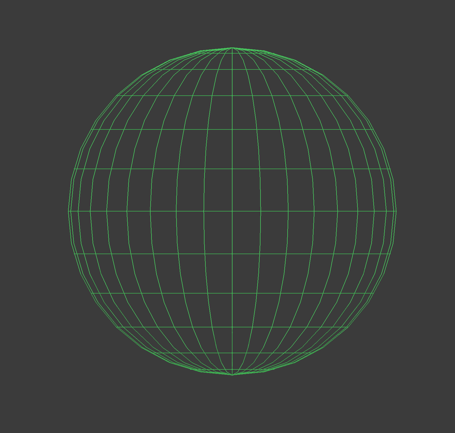

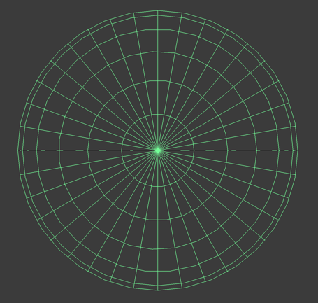

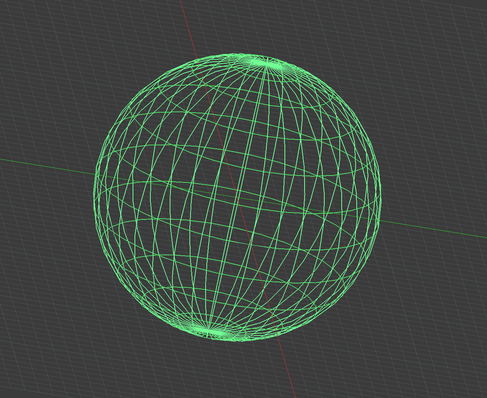

L'acabat final de la plantilla l'hem de fer en 2D, i per tant, per passar del 3D, el més fàcil és fer una projecció sobre el pla XZ o YZ, ja que els paral·lels s'han dibuixat al pla XY.

No obstant això, tenim el problema que, en projectar després de girar la imatge, veiem tant l'estructura de la cara anterior, que és la que ens interessa, com la posterior. Això invalida el resultat.

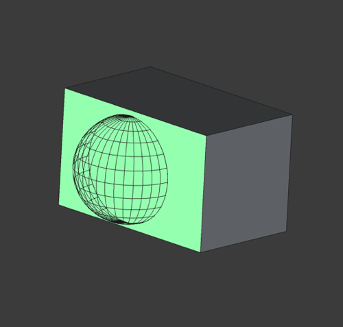

#### 2. Netejar el dibuix eliminant la part que no interessa.

Atès que podem realitzar operacions booleanes de resta, eliminem tot el que estigui a la regió X negativa (regió Y negativa depenent del pla de projecció escollit).

El dibuix adjunt mostra la imatge per a B0=+0.

En restar el cub de la imatge de coordenades, obtenim la part que ens interessa, la qual podem projectar sense interferències.

El resultat en fer la resta, per a B0 = -7, és el següent:

El que hem fet és, abans d'aplicar el tall, girar -7º segons l'eix X.

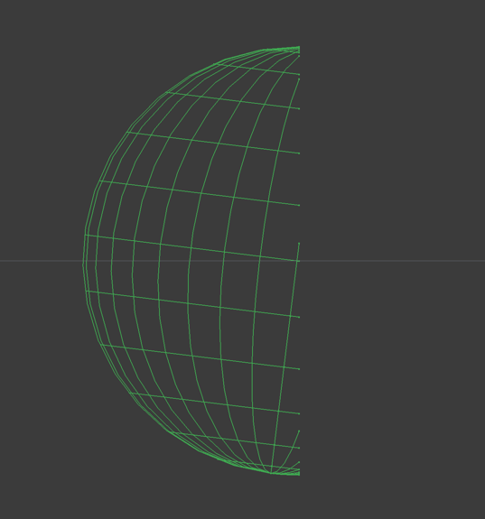

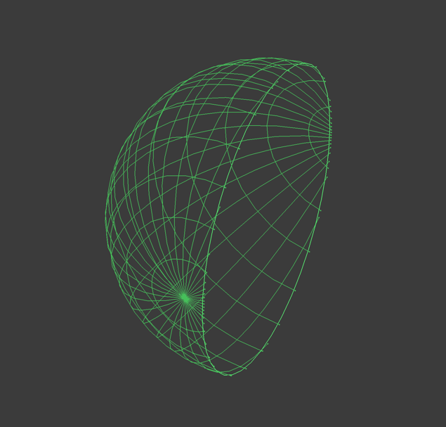

#### 3. Projectar el dibuix en 2D i carregar-lo amb Inkscape per deixar-lo a les mesures necessàries per afegir-lo a les nostres fotos.

En aquest punt ja hem de tenir en compte el format de la foto a la qual aplicarem la màscara.

Hem de aconseguir que la plantilla de la màscara tingui les mateixes dimensions que la foto i, a més, que la reixeta tingui la mateixa mida que el Sol en les nostres captures.

L'equip que utilitzo per fotografiar el Sol consisteix en un refractor acromàtic de 70 mm f13 i una càmera que és la mateixa que utilitzo per al cel profund, la ASI 294MM amb un filtre solar continuum.

Aquest equip em dona unes dimensions del disc solar de 1842 px de diàmetre.

El Sol varia al llarg de l'any entre 32,53 minuts d'arc en el perihel·li i 32,44 minuts d'arc en l'afel·li, per la qual cosa aquesta petita variació no ens crearà problemes pel que fa a la mida de plantilla necessària; en qualsevol cas, prenem la mesura de referència a finals de març o finals de setembre per obtenir un valor mitjà.

Les fotografies les retallo sempre a 2700 px x 2700 px per tenir espai per als comentaris que afegeixo, així que el dibuix de la plantilla ha de ser de 2700 px x 2700 px i la reixeta del Sol ha de tenir un diàmetre de 1842 px.

Aquests valors són els que hem de aconseguir amb el programari de 2D.

## 4. Aplicació de les plantilles amb PixInsight

Com és habitual, utilitzo PixInsight per processar les fotografies, tot i que estic convençut que, aplicant la gestió de capes, es pot aconseguir el mateix resultat amb Photoshop, Gimp, etc...

Repassem el procés que segueixo des de la presa de les dades inicials.

En primer lloc, ajustem el nostre conjunt telescopi-càmera perquè el Sol recorri, si no fem seguiment de les AR, el nostre FOV de dreta a esquerra; això és imprescindible perquè, en aplicar posteriorment el gir i l'ajust de P, ens quedi el Nord a dalt.

Utilitzo el conegut Firecapture per gravar el Sol i després realitzo el processament amb AstroSurface. Amb aquest últim, faig la deconvolució (V-Cittert), l'ajust de wavelets (Wavelets) i la millora de la nitidesa (Sharpen).

Normalment és suficient i ja passo a PixI, on, si necessito fer algun retoc, utilitzo el procés SolarToolbox, potser per ajustar contrastos i per quan vull aplicar color.

Inkscape subministra els fitxers en format *.svg, que és compatible amb PixI i es poden importar directament.

Al fitxer *.fit procedent d'AstroSurface, primerament li aplico:

/Image/Geometry/Rotate 180º .

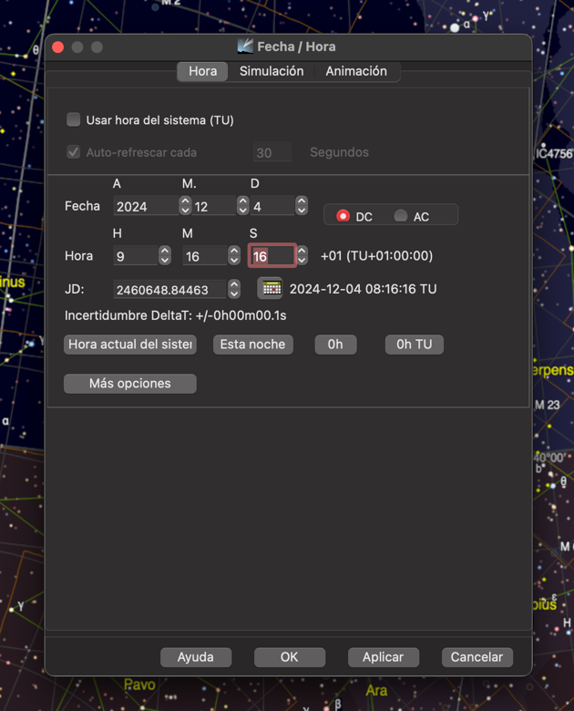

Amb això aconseguim "desfer" el gir vertical i horitzontal generats òpticament pel nostre equip, que recordem és un refractor amb càmera aplicada a foc primari.

El següent que hem de fer és corregir l'angle P per col·locar la nostra foto amb el nord (N) apuntant cap amunt, per normalització, com ja hem explicat.

Aquest valor de P, B0 i L0 els obtenim de Cartes du Ciel (versió 4.3).

En primer lloc desactivem "Usar hora del sistema (TU)" i introduïm l'hora en què hem realitzat la gravació amb Firecapture; podem aprofitar per defecte la que figura en el nom del fitxer perquè correspon al temps mitjà de la nostra gravació.

Apliquem els canvis, validem i seleccionem l'objecte Sol amb la informació adjunta:

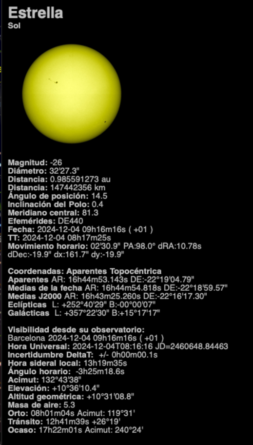

Prenem el valor de l'angle de posició (P) que és 14.5 i ho apliquem a la nostra imatge amb el procés DynamicCrop.

Col·loquem el punt de gir al centre de la imatge del Sol i fem Execute; amb això ja tenim el nostre Sol amb el Nord en posició vertical; el següent pas és retallar, també amb DynamicCrop, a 2700x2700 per normalitzar la mida que utilitzem a la plantilla.

Al mateix temps que creem a Inkscape la nostra plantilla de coordenades, creem una plantilla que anomeno de "text" i que conté el valor de B0 que correspon a cada plantilla ( -7,...,0,....+7) , la lletra que indica l'est (E), la del nord (N) i la indicació dels paral·lels de 0° a 75°.

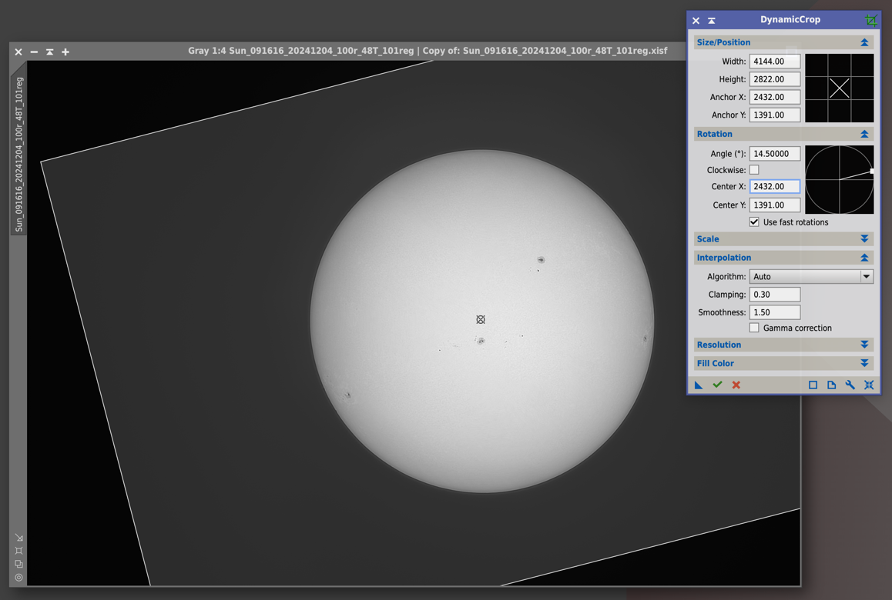

Aquestes són les tres imatges que tenim fins ara; Sol, plantilla coordenades i plantilla text:

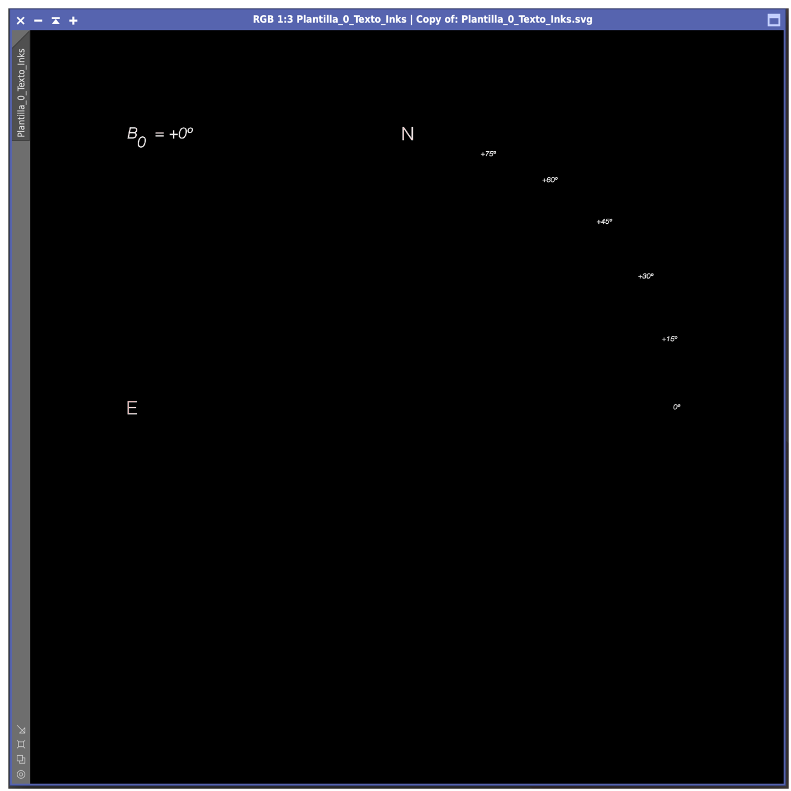

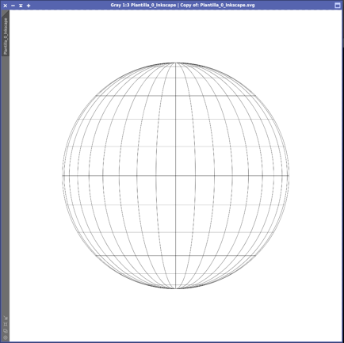

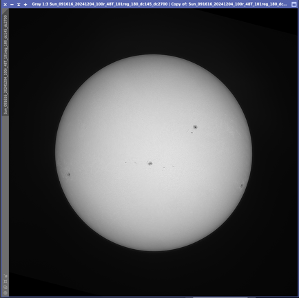

Totes amb la mateixa mida.

Com altres vegades utilitzem el procés PixelMath per aplicar-les sobre la nostra imatge. És idoni per operar píxel a píxel.

La fórmula que utilitzem:

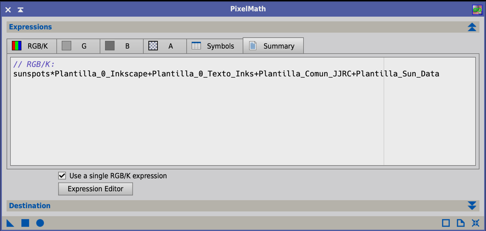

`"sunspots" es refereix a la nostra imatge del Sol. "Plantilla_0_Inkscape" es refereix a la plantilla que hem creat a Inkscape amb B0=+0. "Plantilla_0_Texto_Inks" és la plantilla de text creada a Inkscape per a B0=+0.`

En l'expressió:

sunspots*Plantilla_0_Inkscape+Plantilla_0_Texto_Inks

pot cridar l'atenció el signe "*" entre els dos primers operands quan probablement esperaríem un "+" perquè volem "sumar" (afegir) informació d'una imatge a l'altra; això és així perquè els "filferros" de la plantilla són de color negre, o sigui valor "0"; això vol dir que si els sumem a la superfície del Sol que té un valor alt, diguem "0.8", el resultat seria "0.8" i no veuríem la nostra reixeta.

Per aquest motiu és pel que hem de multiplicar perquè el resultat sigui "0" per als píxels que coincideixen amb la nostra reixeta, és a dir, estem pintant la reixeta sobre el nostre Sol.

El tercer operand ja s'aplica amb una suma perquè els valors de les lletres estan propers al “1” i per tant en sumar-los a valors “0” de la zona experior al Sol, “pintem” els nostres caràcters.

L'operand situat en quart lloc correspon a la meva signatura amb les meves coordenades i el cinquè operand són els valors solars que volem incloure i que se sumen perquè són lletres de color blanc aplicades a fons negre. Aquestes dues plantilles no les he inclòs.

El resultat en aplicar PixelMath amb les tres primeres plantilles és el desitjat:

Com a exemple comparatiu, he generat les imatges per a B0=+7 i B0=-7 respectivament. La comparació mostra les desviacions màxima i mínima que es poden presentar en els valors extrems de la inclinació del pol.

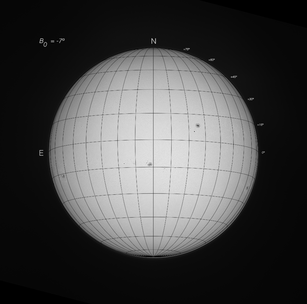

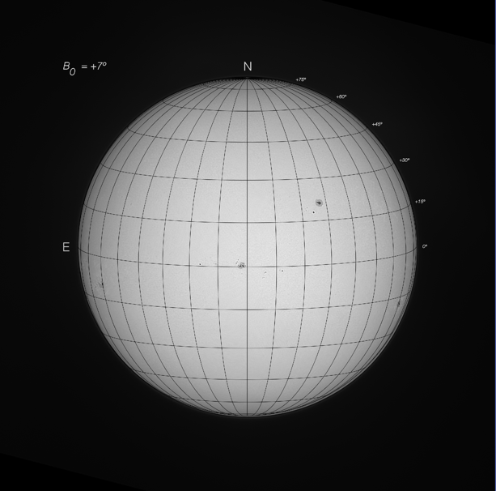

En definitiva, amb aquest mètode aconseguim alinear les nostres fotografies solars amb les referències heliogràfiques oficials, cosa que no només millora la precisió del nostre treball, sinó que també enriqueix la nostra comprensió del comportament del Sol i les seves regions actives.

Fins aviat, amics,

Cels nets!!
